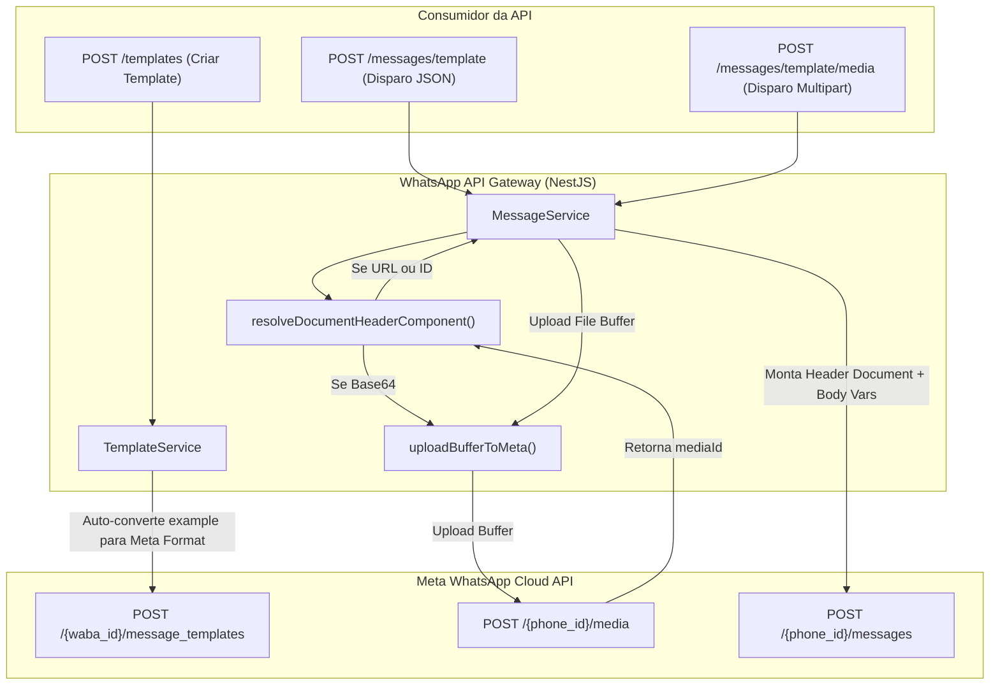

# 📑 Especificação Técnica Completa: Módulo de Templates & Mensageria de Templates

## 1. Visão Geral do Módulo
O módulo de **Templates** tem como responsabilidade gerenciar o ciclo de vida de templates de mensagem na Meta Cloud API (criação, listagem e exclusão) e orquestrar o envio de mensagens baseadas em templates pré-aprovados com máxima eficiência de Developer Experience (DX).

A principal motivação deste módulo é **abstrair as complexidades, aninhamentos e peculiaridades da WhatsApp Cloud API**, permitindo que os consumidores da API cadastrem e enviem mensagens com variáveis e documentos dinâmicos de forma limpa, previsível e sem depender de storage externo (S3/Cloud).

---

## 2. Arquitetura e Fluxo de Dados



---

## 3. Contratos de Interface (Endpoints e DTOs)

### 3.1 `POST /templates` — Criação de Templates na Meta
Cria um novo template de mensagem e submete para aprovação da Meta.

* **Autenticação:** Obrigatória (`Authorization: Bearer <API_KEY>`)
* **Payload (JSON):**

| Campo | Tipo | Obrigatório | Descrição |
|---|---|---|---|
| `connectionId` | number | Sim | ID numérico da conexão interna cadastrada. |
| `name` | string | Sim | Nome único do template (apenas letras minúsculas, números e sublinhados). |
| `category` | string | Sim | `MARKETING` ou `UTILITY`. |
| `language` | string | Não | Idioma do template (padrão: `pt_BR`). |
| `components` | array | Sim | Lista de componentes do template (`HEADER`, `BODY`, `FOOTER`). |

#### Estrutura de Componentes (`components[]`):
* `type`: `'BODY' | 'HEADER' | 'FOOTER'`
* `format`: `'DOCUMENT' | 'TEXT' | 'IMAGE' | 'VIDEO'` (opcional, aplicável a `HEADER`)
* `text`: Texto do componente contendo placeholders (`{{1}}`, `{{2}}`).
* `example`: Valores de exemplo para aprovação.
  * Para `BODY`: pode ser um array plano `["Maria", "25"]` ou o objeto nativo `{ body_text: [["Maria", "25"]] }`.
  * Para `HEADER` com formato `DOCUMENT`: pode ser um array plano `["4::..."]` ou `{ header_handle: ["4::..."] }`.

---

### 3.2 `POST /messages/template` — Disparo de Template via JSON
Envia uma mensagem de template aprovada, suportando interpolação de variáveis e cabeçalho de documento dinâmico.

* **Autenticação:** Obrigatória (`Authorization: Bearer <API_KEY>`)
* **Payload (JSON):**

```json
{
  "connectionId": 1,
  "to": "5511999999999",
  "templateName": "fatura_mensal",
  "language": "pt_BR",
  "document": {
    "url": "https://exemplo.com/fatura.pdf",
    "filename": "Fatura_Outubro.pdf"
  },
  "variables": ["João", "R$ 150,00"]
}
```

#### Campo `document` (Opcional - Escolha 1 das 3 modalidades):
1. **Via `url`:** URL pública acessível pela Meta para download do arquivo.
2. **Via `base64`:** Conteúdo binário codificado em Base64. A API realiza o upload transparente para a Meta e injeta o `mediaId`.
3. **Via `id`:** ID de uma mídia pré-carregada na Meta.
4. **`filename`:** Nome personalizado do arquivo exibido para o cliente no WhatsApp.

---

### 3.3 `POST /messages/template/media` — Disparo de Template via Multipart/Form-Data
Permite o envio direto de um arquivo físico sem necessitar de servidor S3, Base64 ou URL pública.

* **Autenticação:** Obrigatória (`Authorization: Bearer <API_KEY>`)
* **Content-Type:** `multipart/form-data`
* **Campos:**

| Campo | Tipo | Obrigatório | Descrição |
|---|---|---|---|
| `file` | binary | Sim | Arquivo físico do documento (ex: `.pdf`). |
| `connectionId` | number | Sim | ID da conexão. |
| `to` | string | Sim | Número do destinatário com DDI (ex: 5511999999999). |
| `templateName` | string | Sim | Nome do template na Meta. |
| `language` | string | Não | Idioma do template (padrão: `pt_BR`). |
| `filename` | string | Não | Nome personalizado do arquivo no WhatsApp. |
| `variables` | string | Não | Lista de variáveis em formato JSON array (ex: `["João", "150"]`). |

---

### 3.4 `GET /templates/:connectionId`
Consulta todos os templates vinculados à conta WABA da conexão.

### 3.5 `DELETE /templates/:connectionId?templateId=nome_ou_id`
Remove um template da Meta. Aceita o nome oficial do template (recomendado) ou o ID numérico.

---

## 4. Diretrizes de DX (Developer Experience) e Resiliência

1. **Auto-formatação de Exemplos:**
   O cliente nunca precisa memorizar se o formato da Meta é `body_text: [['a', 'b']]` ou `header_handle: ['handle']`. Enviar um array simples `example: ['a', 'b']` é automaticamente convertido para a estrutura correta.
2. **Desacoplamento de Storage Externo (Anti-S3 Lock-in):**
   Consumidores não são obrigados a contratar ou manter buckets S3/GCS públicos para enviar faturas/documentos. O suporte a `base64` e `multipart/form-data` resolve a geração em memória e atende normas de privacidade/LGPD.
3. **Compatibilidade Retroativa:**
   O envio tradicional de templates apenas com texto e variáveis no corpo permanece 100% inalterado. O objeto `document` é estritamente opcional.
4. **Resolução Dinâmica de Identificadores:**
   Tanto `templateName` quanto `templateId` são aceitos. Se o cliente enviar um ID numérico antigo, a API consulta a Meta e resolve o nome do template antes do envio.

---

## 5. Casos de Teste Verificáveis

### Caso Normal (Happy Path - Envio com Base64):
* **Entrada:** `POST /messages/template` com `document.base64: "JVBERi0..."`, `document.filename: "fatura.pdf"`, `variables: ["Cliente", "100"]`.
* **Comportamento:** A API converte a string Base64 em buffer, faz upload para `/{phoneId}/media`, obtém o `id` da Meta e despacha a mensagem de template contendo o componente de `header` (documento) e `body` (parâmetros textuais).
* **Resultado:** HTTP 200/201 com WAMID retornado.

### Caso-Limite (Edge Case - Base64 com Data URL prefix):
* **Entrada:** Base64 com prefixo do navegador `data:application/pdf;base64,JVBERi0...`.
* **Comportamento:** O helper `resolveDocumentHeaderComponent` higieniza a string via regex removendo o cabeçalho URI antes de instanciar o buffer.
* **Resultado:** Upload concluído sem corrupção do binário do arquivo.

### Caso de Falha (Failure Case - Arquivo ausente no Form-Data):
* **Entrada:** `POST /messages/template/media` sem o campo `file`.
* **Comportamento:** Retorna imediatamente `400 Bad Request` com mensagem explicativa: `"O arquivo físico do documento é obrigatório"`.
